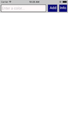
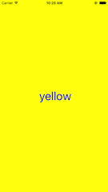
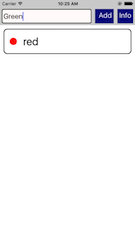
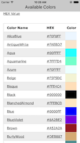

# color-list-react-native
An app to understand response to touches, scroll view, list view and collect data.

# Screen Shots

Empty Color List  

Color Details  

Insterted Color List  

Web View from w3Schools  

